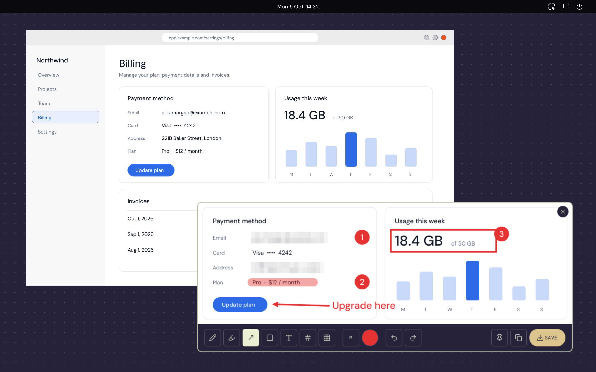
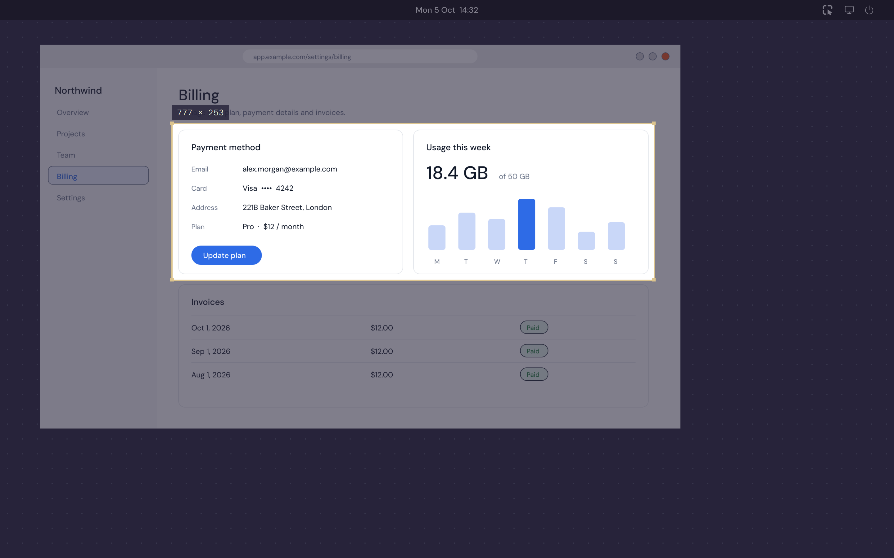
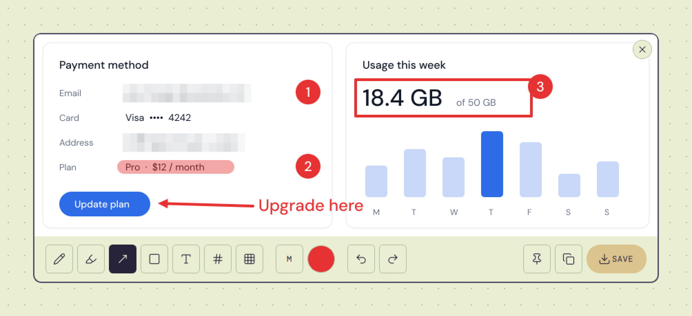
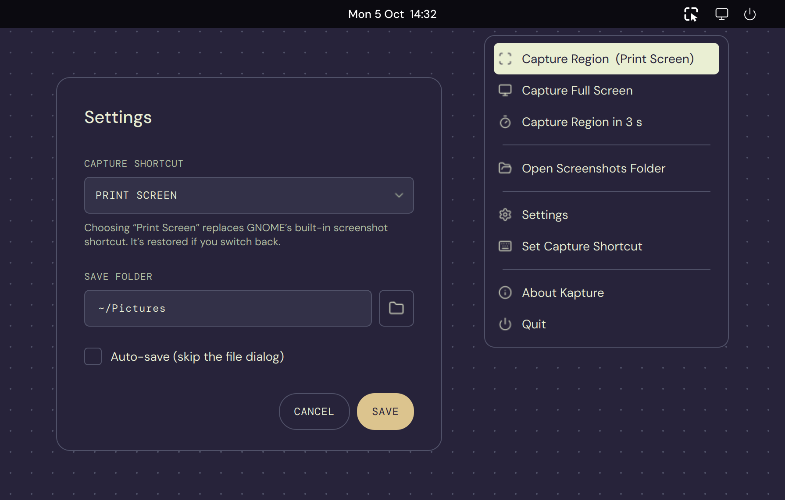

# Kapture — Lightshot-style screenshot tool for Ubuntu



## Screenshots

**Select a region** — the screen freezes and dims; drag to select (it's copied instantly), `Enter` grabs the whole screen.



**Annotate** — pen, highlighter, arrow, box, text, numbered steps and pixelate redaction. Follows your light / dark theme.

<picture>
  <source media="(prefers-color-scheme: dark)" srcset="assets/screenshots/editor-dark.png">
  
</picture>

**Tray & settings** — region, full-screen and delayed capture, your screenshots folder, shortcut and save options.



> Screenshots are rendered from the real UI by `scripts/screenshots.py` — re-run it after UI changes.

## Installation

### For Users — install the .deb package (recommended)

Just like installing Discord or VS Code — one file, done. No Python or terminal knowledge required.

> **Compatible with:** Ubuntu 20.04 and later, on any 64-bit Intel or AMD processor (`amd64`).

> **No screenshot tools to install.** Kapture captures natively — there's nothing extra to set up. On **X11** it works out of the box; on **Wayland** it uses the built-in XDG desktop portal, which ships by default on Ubuntu's GNOME and KDE sessions.

---

**Step 1 — Download the .deb**

Go to the [Releases page](https://github.com/yeakiniqra/Kapture/releases/tag/v4.1.0) and download `kapture_4.1.0_amd64.deb`.

---

**Step 2 — Install**

**Option A — Double-click** the downloaded `.deb` file in your file manager.  
It will open in GNOME Software / GDebi. Click **Install** and enter your password.

**Option B — Terminal**

```bash
sudo dpkg -i kapture_4.1.0_amd64.deb
# if apt reports missing dependencies, pull them in with:
sudo apt -f install
```

---

**Step 3 — Launch**

Search for **Kapture** in your app launcher, or run `kapture` in a terminal.

The app starts silently in the system tray. Press `Print Screen` or `Ctrl+Shift+S` to take a screenshot — the capture is instant and uses no external tools. The capture shortcut, save folder and auto-save can all be changed from **tray → Settings**.

> **GNOME Wayland users — one-time step for flash-free capture.**
> On GNOME's Wayland session the system screenshot portal always plays a shutter flash and asks for permission — that's an OS limitation no normal app can bypass. Kapture ships a tiny **GNOME Shell extension** that captures from inside the Shell with **no flash and no prompt**. The `.deb` installs and registers it automatically; just **log out and back in once** after installing to activate it. Until then, captures fall back to the portal (with the flash). On an **X11/Xorg** session no extension is needed — capture is already instant and flash-free.

---

**Uninstall**

```bash
sudo apt remove kapture
```

---

### For Windows users

> **Compatible with:** Windows 10 and 11, 64-bit.

1. Download `Kapture-<version>-windows-x64.exe` from the [latest release](https://github.com/yeakiniqra/Kapture/releases/latest).
2. Run it. It's a single portable file, so there's nothing to install. Keep it somewhere permanent, such as `Documents\Kapture`, because Kapture registers that path to start with Windows.
3. Windows SmartScreen may warn about an unrecognised app, because the build isn't code-signed. Click **More info → Run anyway**.

Kapture sits in the notification area (the `^` by the clock). Press `Ctrl+Shift+S` to capture, or pick **Print Screen** in Settings. Choosing Print Screen turns off Windows' own Snipping-Tool-on-Print, and switching back restores it.

---

### For Developers — run from source

**Step 1 — Clone the repository**

```bash
git clone https://github.com/yeakiniqra/Kapture.git
cd kapture
```

**Step 2 — Create and activate a virtual environment**

```bash
python3 -m venv venv
source venv/bin/activate
```

**Step 3 — Install Python dependencies**

```bash
pip install -r requirements.txt
```

> No screenshot backend to install — capture is handled in-process by Qt (X11) and the XDG desktop portal (Wayland).

**Step 4 — Run**

```bash
python3 main.py
```

> **GNOME Wayland (running from source):** the flash-free Shell extension is bundled only in the `.deb`. To get flash-free capture during development, install it into your user dir once and log out/in:
> ```bash
> cp -r "extension/kapture-screenshot@yeakiniqra.github.io" ~/.local/share/gnome-shell/extensions/
> gnome-extensions enable kapture-screenshot@yeakiniqra.github.io   # after re-login
> ```
> Without it, source runs fall back to the portal (with the flash).

---

### For Developers — build the .deb yourself

```bash
# Install packaging tools (one-time)
sudo apt install dpkg-dev

# Build .deb (runs PyInstaller then packages it)
bash build_deb.sh
```

Output: `kapture_<version>_amd64.deb` (version read from `kapture/__init__.py`) — ready to share or install.

### For Developers — build the Windows .exe

Windows builds come from the **Windows build** GitHub Actions workflow (`.github/workflows/windows.yml`). It runs the self-test on Windows, builds with PyInstaller, and attaches `Kapture-<version>-windows-x64.exe` to the release whenever a `v*` tag is pushed. You can also start it by hand from the Actions tab. To build locally on Windows:

```powershell
py -3.12 -m venv venv; venv\Scripts\activate
pip install -r requirements.txt
python scripts\selftest.py
pyinstaller kapture.spec        # -> dist\kapture.exe
```

After changing `assets/logo.svg`, regenerate the PNG and `.ico` with `python scripts/make_icons.py`.

### Project structure

```
main.py                 launcher (PyInstaller entry + GNOME shortcut target)
kapture/
  app.py                startup: environment, single instance, Qt + asyncio loop
  tray.py               tray menu, capture flow, hotkeys, IPC
  capture.py            capture backends (X11 grab, Shell helper, portal, grim)
  gnome.py              GNOME keybinding / Print-key handover / helper setup
  dbus.py               session-bus helpers (jeepney)
  config.py             settings file, constants, resource paths
  windows.py            Windows: Print Screen handover, autostart, focus
  theme.py              colour tokens, fonts, stylesheets (light + dark)
  icons.py              Lucide SVG icons tinted to the theme
  ui/overlay.py         region picker
  ui/editor.py          annotation editor
  ui/pin.py             pinned screenshots
  ui/dialogs.py         About, Settings, helper setup, errors
  ui/widgets.py         shared buttons, labels, card dialog
assets/                 logo, fonts (DM Sans / DM Mono), icons (Lucide)
extension/              GNOME Shell helper for flash-free Wayland capture
```

## Usage

1. Press `Print Screen` or `Ctrl+Shift+S` — the screen dims and your cursor becomes a crosshair
2. Click and drag to select a region
3. Release to confirm the selection (it's copied to the clipboard right away) and the editor opens — or press `Enter` to grab the whole screen instead
4. Use the annotation tools to mark up the screenshot:
   - **Pen** `P` — freehand drawing
   - **Highlighter** `H` — translucent marker
   - **Arrow** `A` — directional arrows
   - **Box** `R` — rectangles
   - **Text** `T` — click, type, `Enter` to place (`Esc` cancels)
   - **Numbered steps** `N` — click to drop 1, 2, 3… badges
   - **Pixelate** `B` — drag over anything sensitive; the pixels are baked in and can't be recovered
   - **Stroke size** `[` `]` — small / medium / large (also sets text size)
   - **Colour** — quick swatches or a custom colour; remembered between captures
   - **Undo / Redo** — `Ctrl+Z` / `Ctrl+Shift+Z`
5. **Copy** (`Ctrl+C`), **Save** (`Ctrl+S`), or **Pin** (`Ctrl+P`) to float the shot on screen as an always-on-top reference (drag to move, scroll to zoom, double-click to close)
6. Close the editor with `Esc` or the **✕** in the top-right corner

From the tray you can also **Capture Full Screen** (saved to your folder and copied), **Capture Region in 3 s** (for menus and hover states), and **Open Screenshots Folder**.

## Settings

Open the tray menu → **Settings** to configure:
- **Capture shortcut** — pick the global hotkey (e.g. `Print`, `Ctrl+Shift+S`)
- **Save folder** — where screenshots are written
- **Auto-save** — skip the save dialog and drop straight into the save folder
- **Start with Windows** (Windows only); on Linux the `.deb` installs an autostart entry

Settings persist in `~/.config/kapture/config.json` on Linux and `%APPDATA%\Kapture\config.json` on Windows.

## Features
- Drag to select any region on screen
- Dimmed overlay with a live selection size readout; `Enter` captures the full screen
- Annotation tools: pen, highlighter, arrow, box, **text**, **numbered steps**, **pixelate redaction**, stroke sizes, colour swatches
- **Pin to screen** — keep a screenshot floating on top as a reference
- Full-screen and 3-second-delay capture from the tray
- Light and dark themes that follow your GNOME appearance setting
- **Undo / redo** with full history
- Auto-copy to clipboard on selection, plus explicit **Copy** and **Save** buttons
- Save as PNG, with optional **auto-save** to a chosen folder
- **Settings window** — change the capture hotkey, save folder and auto-save without editing any files
- Close button pinned to the window's top-right corner, like any native app
- Draggable toolbar with remembered last position
- Runs silently in the system tray
- **Native capture pipeline — no external screenshot tools.** Instant `QScreen` grab on X11; on GNOME Wayland a bundled GNOME Shell extension captures **flash-free and prompt-free**, with the XDG desktop portal as the automatic fallback
- Ships a small GNOME Shell extension (`kapture-screenshot@yeakiniqra.github.io`) installed and registered by the `.deb`; activate with one log out/in

## Changelog

### v4.1.0
- **Windows support.** Kapture now runs on Windows 10 and 11 as a portable `.exe`. It includes a global capture hotkey, multi-monitor capture, an optional Print Screen takeover (Windows' Snipping-Tool-on-Print is restored when you switch back), start with Windows, a tray icon that follows the light/dark taskbar, and settings in `%APPDATA%\Kapture`.
- The capture shortcut you choose in Settings now also applies on non-GNOME Linux desktops (X11), not only GNOME.
- Screenshots default to your real Pictures folder, including localised and OneDrive-redirected ones.

### v4.0.0
- **Rebuilt on Qt 6 (PySide6)** and split the single `main.py` into a `kapture` package
- **New tools:** text, highlighter, numbered steps, stroke sizes, colour swatches
- **Pin to screen**, **full-screen capture** (tray or `Enter` in the overlay), **3-second delayed capture**, **Open Screenshots Folder**
- **New look:** flat monochrome design with light/dark themes that follow GNOME, DM Sans / DM Mono type, Lucide line icons, and a new minimal app icon
- Very large selections now scale to fit the screen in the editor; sharp on HiDPI displays
- D-Bus moved to `jeepney` (pure Python)

### v3.0.1
- **Fixed: Print Screen capture no longer permanently disables GNOME's built-in screenshot.** Earlier versions stripped `Print` from GNOME's `show-screenshot-ui` keybinding to claim it, but never restored it. Kapture now **backs up** GNOME's screenshot keybindings before borrowing `Print` and **restores** them automatically when you change the capture hotkey to something else or uninstall the package (falling back to GNOME's factory defaults if no backup is found).

### v3.0.0
- **Pixelate / redaction tool** — drag to obscure sensitive areas; pixelation is committed as a baked layer so it can't be peeled back off the PNG
- **Settings window** — configure the capture shortcut, save folder and auto-save from the tray; persisted to `~/.config/kapture/config.json`
- **Undo / redo** for all annotations (`Ctrl+Z` / `Ctrl+Shift+Z`)
- **Close button moved to the window's top-right corner**, matching standard Ubuntu window controls
- **Selection drop shadow / accent glow** so the captured region stands out from the dimmed background
- **Print Screen fix** — Kapture now claims the `Print Screen` key instead of letting it trigger GNOME's built-in screenshot, via a single-instance IPC trigger and GNOME custom keybinding

### v2.0.0
- **Native capture pipeline** — removed the dependency on `gnome-screenshot` / `scrot`; capture is now an in-process `QScreen` grab on X11 and the XDG desktop portal on Wayland
- **Flash-free, prompt-free Wayland capture** via a bundled GNOME Shell extension that runs inside the Shell's privileged context
- Modernised annotation editor, About dialog and system-tray menu/icon
- Added a **Copy** button alongside Save
- `.deb` installs and registers the Shell extension automatically

### v1.0.0
- Initial release — region selection, pen/arrow/rectangle annotation, clipboard copy, PNG save, system-tray operation

## Contributing

Contributions are welcome! Feel free to open issues or submit pull requests.

1. Fork the repository
2. Create a feature branch (`git checkout -b feature/my-feature`)
3. Commit your changes (`git commit -m 'Add my feature'`)
4. Push to the branch (`git push origin feature/my-feature`)
5. [Open a Pull Request](https://github.com/yeakiniqra/Kapture/pulls)

## License

This project is licensed under the **MIT License**.

```
MIT License

Copyright (c) 2026 Kapture Contributors

Permission is hereby granted, free of charge, to any person obtaining a copy
of this software and associated documentation files (the "Software"), to deal
in the Software without restriction, including without limitation the rights
to use, copy, modify, merge, publish, distribute, sublicense, and/or sell
copies of the Software, and to permit persons to whom the Software is
furnished to do so, subject to the following conditions:

The above copyright notice and this permission notice shall be included in all
copies or substantial portions of the Software.

THE SOFTWARE IS PROVIDED "AS IS", WITHOUT WARRANTY OF ANY KIND, EXPRESS OR
IMPLIED, INCLUDING BUT NOT LIMITED TO THE WARRANTIES OF MERCHANTABILITY,
FITNESS FOR A PARTICULAR PURPOSE AND NONINFRINGEMENT. IN NO EVENT SHALL THE
AUTHORS OR COPYRIGHT HOLDERS BE LIABLE FOR ANY CLAIM, DAMAGES OR OTHER
LIABILITY, WHETHER IN AN ACTION OF CONTRACT, TORT OR OTHERWISE, ARISING FROM,
OUT OF OR IN CONNECTION WITH THE SOFTWARE OR THE USE OR OTHER DEALINGS IN THE
SOFTWARE.
```
